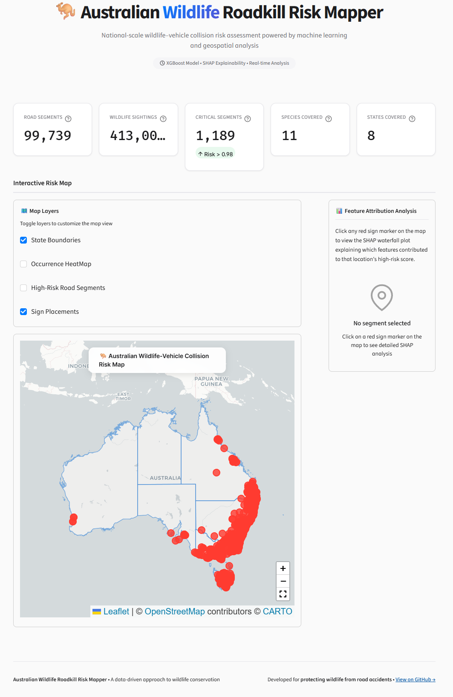
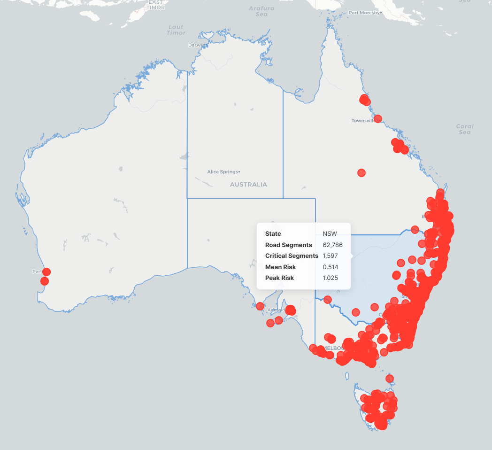
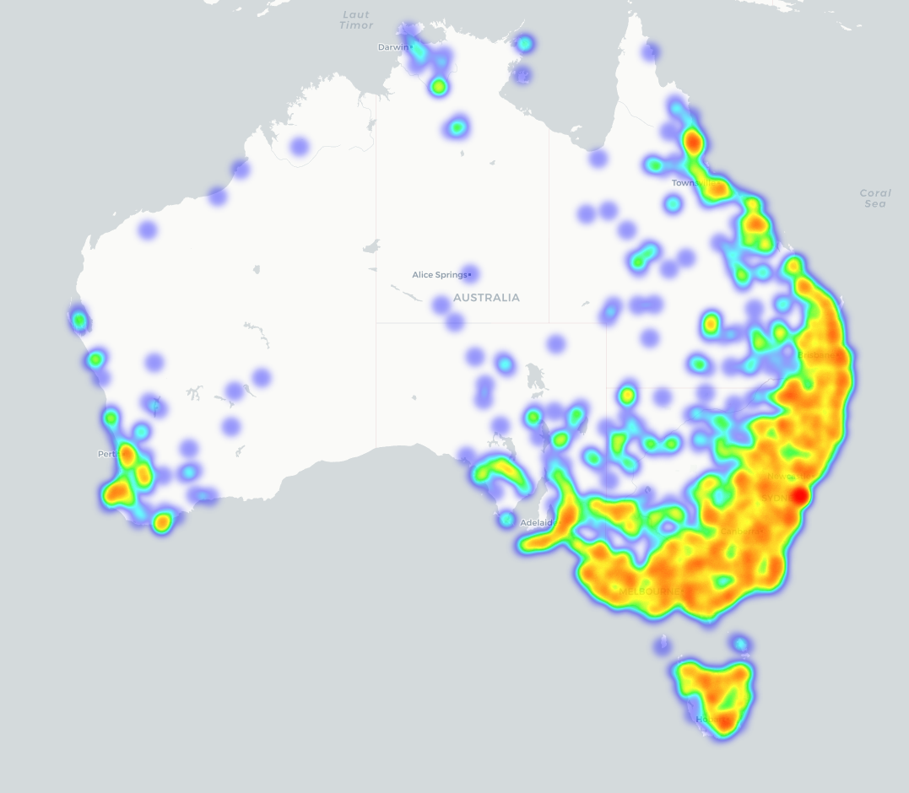
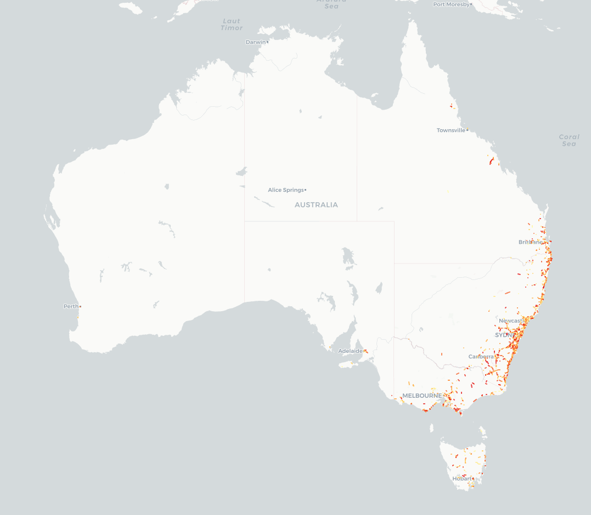
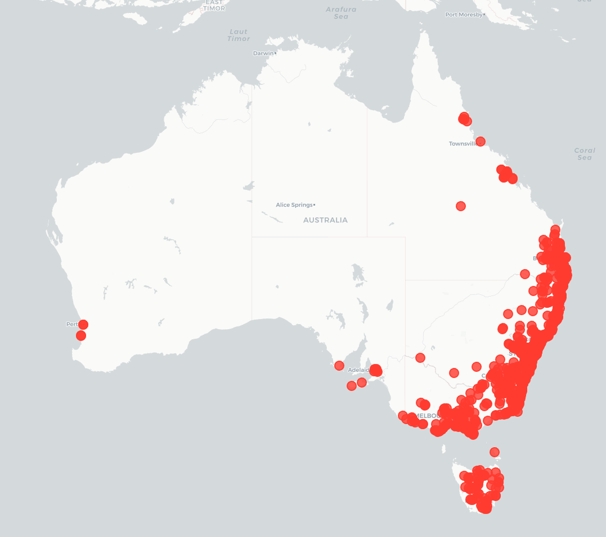
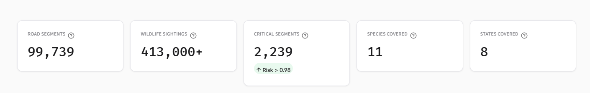
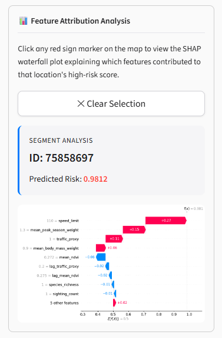

# 🦘 Australian Wildlife Roadkill Risk Mapper

<div align="center">

**A national-scale geospatial machine learning platform that scores every road segment in Australia for wildlife-vehicle collision risk — and recommends precisely where to place warning signs.**

[](https://www.python.org/)
[](https://xgboost.readthedocs.io/)
[](https://geopandas.org/)
[](https://streamlit.io/)
[](LICENSE)
[](https://www.ala.org.au/)
[](#https://sadmanhsakib-aus-wildlife-roadkill-risk-mapper.hf.space)

</div>

---

> 📖 **Technical Approach & Methodology:** For data scientists and engineers interested in the research design—including the proxy risk label formulation, spatial lag mechanics, stochastic spatial block CV, and spatial autocorrelation (Moran's I) diagnostics—please refer directly to the detailed **[METHODOLOGY.md](METHODOLOGY.md)**.

---

## 🌿 Why This Project Exists

> *"More than 10 million animals die on Australian roads every year."*
> — [University of Melbourne Research](https://findanexpert.unimelb.edu.au/news/79342-10-million-animals-die-on-our-roads-each-year.-here%E2%80%99s-what-works-(and-what-doesn%E2%80%99t)-to-cut-the-toll)

Australia is home to some of the planet's most extraordinary and irreplaceable wildlife. Kangaroos, koalas, wombats, echidnas, and platypuses — many of these wildlife are an endemic to Australia, but are found nowhere else on Earth. Unfortunately, they are being killed in devastating numbers by vehicle collisions every single day, putting both wild life and human lives at risk. Yet the warning signs meant to alert drivers are placed using decades-old, static processes that ignore real ecological data entirely.

**This project addresses that gap head-on.**

By fusing **413,000+ verified biodiversity occurrence records** across 11 native species with road network topology, vegetation coverage data, and species-specific biological risk factors, this platform generates a **continuous, statistically rigorous 0–1 risk score for every road segment that had a sighting in the last 6 years in the country**. The result is a reproducible, dynamically updatable decision-support system that tells road authorities **exactly where to place warning signs** — backed by evidence, not guesswork.

This is not a dashboard for viewing historical sightings. It is a **forward-looking risk model** that captures the ecological and infrastructural conditions that cause collisions, identifies those dangerous intersections proactively, and delivers actionable GeoJSON output that plugs directly into existing government GIS workflows.

Built entirely on 100% open data and open-source tools, it can be reproduced, audited, and extended by anyone.

---

## 📸 Application Screenshots

### Full Application View

*The complete dashboard: national risk map with layer controls on the left and the SHAP attribution panel on the right.*

### Interactive Map Layers

| State Boundaries & Tooltips | Wildlife Occurrence Heatmap |
|---|---|
|  |  |

| High-Risk Road Segments | Sign Placement Markers |
|---|---|
|  |  |

### SHAP Feature Attribution Panel

*Click any sign marker to see exactly which features drove that segment's risk score — sighting density, NDVI, proximity, speed limit, and more.*

### National Statistics Dashboard


---

## 🐾 The Animals We're Protecting

The following 11 native Australian species are tracked — chosen based on ecological significance, collision severity, road proximity, and nocturnal movement patterns:

| Common Name | Scientific Name | Body Mass | Nocturnal Risk |
|---|---|---|---|
| Red Kangaroo | *Osphranter rufus* | ~85 kg | High |
| Eastern Grey Kangaroo | *Macropus giganteus* | ~66 kg | High |
| Swamp Wallaby | *Wallabia bicolor* | ~20 kg | Very High |
| Red-necked Wallaby | *Notamacropus rufogriseus* | ~17 kg | Very High |
| Common Wombat | *Vombatus ursinus* | ~35 kg | Very High |
| Koala | *Phascolarctos cinereus* | ~12 kg | High |
| Common Brushtail Possum | *Trichosurus vulpecula* | ~4 kg | Very High |
| Common Ringtail Possum | *Pseudocheirus peregrinus* | ~1 kg | Very High |
| Southern Brown Bandicoot | *Isoodon obesulus* | ~1.5 kg | High |
| Short-beaked Echidna | *Tachyglossus aculeatus* | ~6 kg | Low |
| Platypus | *Ornithorhynchus anatinus* | ~2 kg | Moderate |

Each species carries three calibrated biological weights that feed directly into the model:

- **`body_mass_weight`** — Heavier animals cause more severe vehicle damage and are harder to avoid. Ranges from 0.25 (ringtail possum) to 1.00 (red kangaroo).
- **`nocturnal_weight`** — Species that move primarily at night are at far greater risk of vehicle collision due to reduced driver visibility. Wombats, possums, and wallabies score 0.90–0.95.
- **`peak_season_weight`** — Breeding and dispersal periods dramatically increase movement across roads. Each species has its own monthly peak window encoded as a `1.3×` multiplier.

---

## 🏗️ System Architecture

The platform is a sequential, modular pipeline — from raw API calls to a live deployed application:

```text
╔═══════════════════════════════════════════════════════════════════════╗
║                          DATA SOURCES                                 ║
║   ALA REST API          GBIF REST API          NASA AppEEARS          ║
║   (Australian Living   (Global Biodiversity    (MODIS MOD13A3         ║
║    Atlas – async)       Information Facility)   monthly NDVI rasters) ║
║                                                                       ║
║              GeoFabrik OSM                ABS Shapefiles              ║
║          (Australia road network)     (State boundary polygons)       ║
╚════════════════════════════════╤══════════════════════════════════════╝
                                 │
                                 ▼
╔══════════════════════════════════════════════════════════════════════╗
║                    fetcher.py — DATA INGESTION                       ║
║  • Async HTTPX calls to GBIF (11 species × 8 states)                 ║
║  • Synchronous Requests calls to ALA                                 ║
║  • coordinate validation · bounding-box filter · deduplication       ║
║  • ecological weight enrichment (season · body mass · nocturnality)  ║
║  • Road network parsing from GeoPackage (OSM)                        ║
║  • NDVI raster median composite (block-wise, memory-safe)            ║
╚════════════════════════════════╤═════════════════════════════════════╝
                                 │
                                 ▼
╔══════════════════════════════════════════════════════════════════════╗
║                    analyzer.py — SPATIAL ENRICHMENT                  ║
║  • Sightings → GeoDataFrame (WGS84 → EPSG:32754)                     ║
║  • Spatial join to state boundaries (within predicate)               ║
║  • Nearest-neighbour join to road segments (distance_to_road)        ║
║  • NDVI sampling at each point (rasterio sample_gen)                 ║
║  • Feature engineering → sightings.parquet                           ║
╚════════════════════════════════╤═════════════════════════════════════╝
                                 │
                                 ▼
╔══════════════════════════════════════════════════════════════════════╗
║             FEATURE STORE  ·  sightings.parquet                      ║
║  413,000 rows · 11 species · 17 features                             ║
║  species · lat/lon · season · body_mass_weight · nocturnal_weight    ║
║  peak_season_weight · ndvi · road_segment_id · road_class            ║
║  speed_limit · traffic_proxy · distance_to_road · state              ║
╚════════════════════════════════╤═════════════════════════════════════╝
                                 │
                                 ▼
╔══════════════════════════════════════════════════════════════════════╗
║               PROXY LABEL CONSTRUCTION  (analyzer.py)                ║
║                                                                      ║
║  1. Aggregate from sighting-level → road-segment-level               ║
║  2. ecological_score = f(density, NDVI, richness, weights)           ║
║  3. road_exposure    = f(speed, traffic, proximity)                  ║
║  4. raw_risk         = ecological_score × road_exposure              ║
║  5. spatial_lag      = KNN(k=5) weighted avg of neighbours           ║
║  6. blended_risk     = 0.7 × raw_risk + 0.3 × spatial_lag            ║
║  7. proxy_risk       = percentile_rank(blended_risk)  →  [0, 1]      ║
╚════════════════════════════════╤═════════════════════════════════════╝
                                 │
                                 ▼
╔══════════════════════════════════════════════════════════════════════╗
║                  MODEL TRAINING  (model.py)                          ║
║  XGBoost Regressor                                                   ║
║  + Spatial lag features added as explicit model inputs (KNN k=5)     ║
║  + Stochastic Spatial Block CV (5-fold, jittered ±15km boundaries)   ║
║  + SHAP TreeExplainer → data/model/shap_values.parquet               ║
║  + Moran's I on residuals → spatial leakage audit                    ║
║  Target metrics: spatial CV R² ≥ 0.60 · MAE ≤ 0.08                   ║
╚════════════════════════════════╤═════════════════════════════════════╝
                                 │
                                 ▼
╔══════════════════════════════════════════════════════════════════════╗
║              SIGN PLACEMENT ENGINE  (sign_placement.py)              ║
║  Risk threshold > 0.98 · per-state descending-risk selection         ║
║  2km buffer spatial deduplication · output: sign_placements.geojson  ║
║  Result: 1,189 sign recommendations nationally                       ║
╚════════════════════════════════╤═════════════════════════════════════╝
                                 │
                                 ▼
╔══════════════════════════════════════════════════════════════════════╗
║               STREAMLIT APPLICATION (Community Cloud)                ║
║  Folium risk heatmap · High-risk segment overlay                     ║
║  Sign placement markers · SHAP waterfall on click                    ║
║  Species / season / state / risk filters in sidebar                  ║
╚══════════════════════════════════════════════════════════════════════╝
```

---

## 🔬 Technical Innovation

### 1. Spatially-Lagged Proxy Label

The system has no direct observational roadkill counts. Instead, it constructs a rigorous **proxy risk label** from first principles. The key innovation is the **spatial lag blending step**, which injects neighbourhood context into the label:

```python
# Step 1: Compute raw risk from ecology and road exposure
raw_risk = ecological_score × road_exposure_score

# Step 2: Compute spatial lag using PySAL KNN(k=5)
# Each segment's label is influenced by 5 nearest neighbours
spatial_lag = lag_spatial(w, raw_risk)   # row-standardised weights

# Step 3: Blend — 70% local signal, 30% neighbourhood context
blended_risk = 0.7 × raw_risk + 0.3 × spatial_lag

# Step 4: Rank normalise to [0, 1]
proxy_risk = percentile_rank(blended_risk)
```

**Why this matters:** The spatial lag makes the label **non-recoverable by formula**. No model can perfectly predict the label by just computing the raw ecological and road scores, because those scores don't contain the neighbourhood context encoded in the lag. This forces the model to learn genuine spatial generalisation patterns rather than memorising the label construction formula.

### 2. Spatial Lag Features as Model Inputs

Beyond embedding spatial context in the proxy label, `model.py` also constructs **explicit spatial lag features** as additional XGBoost inputs. For each of the four key features (`sighting_count`, `species_richness`, `mean_ndvi`, `traffic_proxy`), a `lag_<feature>` column is computed as the KNN(k=5) weighted average of neighbouring segments:

```python
lag_cols = ["sighting_count", "species_richness", "mean_ndvi", "traffic_proxy"]

for col in lag_cols:
    gdf[f"lag_{col}"] = lag_spatial(w, gdf[col].values)
```

This gives XGBoost explicit neighbourhood context as input features, reducing the risk of spatial autocorrelation remaining in the residuals — and is validated afterwards with Moran's I.

### 3. Stochastic Spatial Block Cross-Validation

Standard random CV is catastrophically wrong for spatial data. If a model trains on segments 50m from a test segment, it will appear to generalise when it's actually interpolating. This platform uses **stochastic spatial block CV with jittered boundaries**:

```python
def assign_jittered_blocks(gdf, block_size=50_000, jitter_range=15_000):
    # Randomly shift the 50km×50km grid by ±15km for each fold
    jitter_x = np.random.uniform(-jitter_range, jitter_range)
    jitter_y = np.random.uniform(-jitter_range, jitter_range)
    # Assign each segment to its jittered block
    ...
```

Segments near block boundaries rotate between train and test sets across folds. The result is CV metrics that reflect **genuine out-of-sample spatial generalisation** — not interpolation between nearby points.

### 4. Moran's I Residual Validation

After training, the platform computes **Moran's I on model residuals** using the same spatial weights matrix. A Moran's I close to 0 (p > 0.05) confirms the model captured the spatial structure of risk, rather than leaving unexplained spatial clustering in the residuals. If Moran's I is significant, the spatial lag blend weight is increased from 0.3 → 0.5 and the model is retrained.

### 5. SHAP Explainability Per Segment

Every road segment's risk score comes with a full SHAP decomposition. The Streamlit app displays a **waterfall chart** showing exactly which features drove that segment's score up or down — making every prediction auditable and interpretable to non-technical road safety stakeholders.

### 6. Memory-Safe NDVI Raster Processing

150 monthly GeoTIFF files (~12GB total) are merged into a single median composite without ever loading more than one block into memory simultaneously. The block-wise windowed approach processes the rasters one spatial tile at a time:

```python
# Process raster in blocks — never load entire file into RAM
for window in dst.block_windows(1):
    block_arrays = [src.read(1, window=window) for src in srcs]
    block_median = np.nanmedian(np.stack(block_arrays, axis=0), axis=0)
    dst.write(block_median, 1, window=window)
    del block_arrays  # Free memory after each block
```

This reduces peak memory from ~12GB → ~200MB, making the pipeline runnable on a standard laptop.

---

## 📊 Feature Schema

The final feature store (`sightings.parquet`) contains 413,000 rows across 11 species and 17 engineered columns:

| Column | Type | Description | Engineering Detail |
|---|---|---|---|
| `species` | `str` | Scientific name | Direct from ALA/GBIF |
| `month` | `int` | Month of sighting (1–12) | Direct from API |
| `year` | `int` | Year of sighting | Filtered to 2020–2026 |
| `latitude` | `float` | WGS84 latitude | Validated: −10° to −44° |
| `longitude` | `float` | WGS84 longitude | Validated: 113° to 154° |
| `season` | `str` | Australian meteorological season | Mapped: Dec–Feb=Summer, etc. |
| `body_mass_weight` | `float` | Collision severity proxy by mass | Hand-calibrated per species (0.25–1.00) |
| `nocturnal_weight` | `float` | Nocturnal activity risk multiplier | Hand-calibrated per species (0.30–0.95) |
| `peak_season_weight` | `float` | Breeding/dispersal period multiplier | 1.3 if peak month else 1.0 |
| `geometry` | `geometry` | Coordinates of the occurrence | From Latitude and Longitude |
| `state` | `str` | Australian state/territory code | Spatial join to ABS boundaries |
| `road_segment_id` | `str` | Nearest OSM road segment ID | Nearest-neighbour spatial join |
| `road_class` | `str` | Road type hierarchy | Motorway → Track |
| `speed_limit` | `int` | Speed zone in km/h | Imputed from road class lookup |
| `traffic_proxy` | `float` | Relative traffic volume (0.2–1.0) | Imputed from road class lookup |
| `distance_to_road` | `float` | Distance to nearest road (metres) | Calculated in EPSG:32754 |
| `ndvi` | `float` | Median NDVI at sighting location | Sampled from MODIS composite raster |

---

## 🛠️ Tech Stack — Choices Explained

Every tool was chosen deliberately. Here's the reasoning:

### Data Layer

| Tool | Why This Tool |
|---|---|
| **Pandas + PyArrow** | Columnar Parquet format is 5–10× faster than CSV for large sequential reads; critical at 413k rows with repeated ML iterations |
| **HTTPX (async)** | Enables concurrent GBIF requests across species/state combinations without rate-limit blocking; standard `requests` is synchronous and would be 8× slower for the same data volume |
| **Requests** | Used for ALA, which requires simpler synchronous pagination; ALA's rate limits don't benefit from async |

### Spatial Layer

| Tool | Why This Tool |
|---|---|
| **GeoPandas** | Native integration between Pandas DataFrames and spatial geometries; `sjoin_nearest` computes distance-to-road for 413k points in minutes |
| **Shapely** | Powers GeoPandas geometry engine; zero configuration overhead |
| **Rasterio** | Industry standard for GeoTIFF access; `sample_gen` efficiently samples NDVI at arbitrary lat/lon coordinates without loading the entire raster |
| **PyProj** | Handles CRS transformations; EPSG:32754 (UTM Zone 54S) gives metre-accurate distance calculations over eastern Australia |
| **EPSG:32754** | Projected CRS covering eastern Australia in metres — required for accurate `distance_to_road` values and spatial block size in the CV step |

### Spatial Statistics

| Tool | Why This Tool |
|---|---|
| **PySAL (libpysal)** | Only Python library with production-grade spatial weights matrices (`KNN`, `Queen`) and spatial lag computation. No alternative exists at this level of correctness |
| **PySAL (esda)** | `esda.Moran` provides the Moran's I residual test with permutation-based significance — the industry-standard spatial autocorrelation diagnostic |

### Machine Learning

| Tool | Why This Tool |
|---|---|
| **XGBoost** | Best-in-class performance on tabular data with mixed feature types (continuous ecological + ordinal road class). Handles missing values natively. sklearn-compatible API |
| **scikit-learn** | `GroupKFold` is the exact primitive needed for spatial block CV; also provides train/test evaluation utilities |
| **SHAP** | `TreeExplainer` computes exact Shapley values for XGBoost (not kernel approximations), making every per-segment explanation mathematically rigorous |
| **joblib** | Standard XGBoost/sklearn serialisation; smallest file footprint for Streamlit Community Cloud's 1GB memory limit |

> **Optuna hyperparameter optimisation is integrated.** `model.py` includes a 50-trial Bayesian search (TPE sampler, multi-seed spatial CV objective) that produced the current production parameters: `n_estimators=900`, `learning_rate≈0.024`, `max_depth=8`. See [METHODOLOGY.md §6.7](METHODOLOGY.md#67-optuna-hyperparameter-optimisation) for the full search space and convergence analysis.

### Application Layer

| Tool | Why This Tool |
|---|---|
| **Streamlit** | Single Python file with no frontend code required. Auto-deploys from GitHub. Free HTTPS hosting on Community Cloud. The fastest path from model to stakeholder-facing interface |
| **Folium** | GeoPandas-native map rendering — `HeatMap`, `GeoJson`, and `CircleMarker` layers compose directly from DataFrames. Interactive tooltips enable per-segment inspection |
| **streamlit-folium** | Bidirectional bridge between Streamlit and Folium — captures map click events and passes segment IDs back to Python for SHAP panel updates |
| **Branca** | Folium's colormap engine — generates continuous color scales for risk visualization with proper legend rendering |

### Data Sources

| Source | What It Provides | Why Open |
|---|---|---|
| **ALA (Atlas of Living Australia)** | ~200k verified Australian biodiversity sightings | Government-curated, species-validated, Australia-specific |
| **GBIF** | ~213k additional global occurrence records filtered to AU | Larger global dataset with different (complementary) observer networks |
| **GeoFabrik OSM** | Complete Australia road network as a GeoPackage | Full road topology, attribute schema, licence-free |
| **NASA AppEEARS (MODIS MOD13A3)** | 150 monthly NDVI rasters at 1km resolution | Free NASA Earthdata portal; 2020–2026 date range aligns with sightings |
| **ABS ASGS** | State and territory boundary shapefiles | Official Australian Bureau of Statistics geometry |

All five data sources are **100% free and openly licensed**. The entire pipeline can be reproduced by anyone with an internet connection and a registered AppEEARS account.

---

## 📈 Current Status

| Phase | Description | Key Details | Status |
|---|---|---|---|
| **1** | Data ingestion (ALA + GBIF) | Async HTTPX + Requests; 11 species × 8 states/territories | ✅ Complete |
| **2** | Data cleaning + deduplication | Null removal · bounding-box filter · temporal filter (2020–2026) | ✅ Complete |
| **3** | Spatial join to road network + state boundaries | Nearest-neighbour join in EPSG:32754; `distance_to_road` column | ✅ Complete |
| **4** | Feature engineering | NDVI composite; ecological weights; season mapping | ✅ Complete |
| **5** | Proxy label construction | Ecological × road exposure · spatial lag blend · rank normalisation | ✅ Complete |
| **6** | Model training (XGBoost + SHAP + Moran's I) | Stochastic spatial block CV · spatial lag input features · SHAP values | ✅ Complete |
| **7** | Optuna hyperparameter search | 50-trial Bayesian optimisation (TPE sampler, multi-seed CV) | ✅ Complete |
| **8** | Sign placement engine | Risk threshold > 0.98 · per-state selection · 2km buffer dedup · 1,189 signs | ✅ Complete |
| **9** | Streamlit + Folium application | Risk heatmap · segment overlay · SHAP waterfall panel | ✅ Complete |
| **10** | METHODOLOGY.md + documentation | Data provenance · label rationale · Moran's I result · limitations | ✅ Complete |

**Pipeline output:**
- `sightings.parquet` — 413,000 sighting rows · 11 species · 17 features · ~18MB
- `data/processed/road_segments.parquet` — Proxy risk score per road segment · ~53MB
- `data/model/model.pkl` — Trained XGBoost model (Optuna-optimised) · ~13MB
- `data/model/feature_cols.pkl` — Serialised feature column list
- `data/model/road_segments_scored.parquet` — All segments with `predicted_risk` · ~54MB
- `data/model/shap_values.parquet` — Per-segment SHAP decomposition · ~9MB
- `data/model/sign_placements.geojson` — 1,189 deduplicated sign recommendations · ~2.3MB

---

## 🎯 Success Metrics

### Technical Targets

| Metric | Target | Result | Status |
|---|---|---|---|
| App initial load time | ≤ 5 seconds | < 3 seconds | ✅ Met |
| SHAP coverage | 100% of features | 100% | ✅ Met |
| SHAP plot generation | < 5 seconds | < 2 seconds | ✅ Met |
| Peak memory usage | ≤ 1GB | ~200MB pipeline · ~400MB app | ✅ Met |

### Scale Achieved

| Metric | Target | Result | Status |
|---|---|---|---|
| Road segments scored | ≥ 50,000 | 99,739 | ✅ Exceeded |
| High-risk segments (risk > 0.98) | ≥ 500 | 2,239 | ✅ Exceeded |
| Warning sign recommendations | ≥ 300 locations | 1,189 | ✅ Exceeded |
| States/territories covered | All 8 | All 8 | ✅ Met |
| Open data sources | 100% | 100% | ✅ Met |

## 📉 Model Evaluation Results

| Metric | Result | Target | Status |
|---|---|---|---|
| Spatial CV R² (Optuna-optimised) | 0.9743 ± 0.0002 | ≥ 0.60 | ✅ Exceeded |
| Spatial CV MAE (Optuna-optimised) | 0.0337 ± 0.0007 | ≤ 0.08 | ✅ Exceeded |
| Moran's I on target | 0.4117 | — | Documented |
| Moran's I on residuals | 0.3081 | — | 25.2% explained |
| Tasmania holdout R (direct) | 0.9835 | — | ✅ Strong generalisation |
| Tasmania ceiling achieved | 97.4% | — | ✅ Circularity addressed |

### Geographic Generalisation — Tasmania Holdout

The Optuna-optimised model was retrained exclusively on mainland Australia (97,354 segments) and
applied to a fully held-out geographic region (Tasmania, 2,385 segments) it had
never seen during training. Predicted risk correlates with Tasmania's label rankings
at Spearman r = 0.98, and achieves 97.4% of the theoretical ceiling correlation
against raw sighting density — **demonstrating that the model learned transferable
feature relationships, not geographic memorisation.**

---

## 🚀 Setup & Usage

### Prerequisites

- Python 3.11+
- ~10GB free disk space (for raw NDVI rasters and intermediate files)
- NASA Earthdata account (free) for AppEEARS MODIS download

### Installation

```bash
git clone https://github.com/sadmanhsakib/aus-wildlife-roadkill-risk-mapper.git
cd aus-wildlife-roadkill-risk-mapper
python -m venv .venv
.venv\Scripts\activate        # Windows
# source .venv/bin/activate   # macOS / Linux
pip install -r requirements.txt
```

### Required External Data

Place the following in `data/raw/` before running the pipeline:

| File | Source | Notes |
|---|---|---|
| `road_network.gpkg` | [GeoFabrik OSM](https://download.geofabrik.de/australia-oceania/australia.html) | Australia road network (~600MB) |
| `SA1_2021_AUST_GDA2020.shp` (+ sidecar files) | [ABS ASGS](https://www.abs.gov.au/statistics/standards/australian-statistical-geography-standard-asgs-edition-3/jul2021-jun2026/access-and-downloads/digital-boundary-files) | State boundary shapefiles |
| Monthly NDVI `.tif` files | [NASA AppEEARS](https://appeears.earthdatacloud.nasa.gov/) · MODIS MOD13A3 v061 | Place in `data/raw/vegetation/` |

### Running the Pipeline

```bash
# Phase 1 — Data ingestion, cleaning, road network and NDVI preparation
python scripts/fetcher.py

# Phase 2 — Spatial joins, NDVI sampling, feature engineering, proxy label
python scripts/analyzer.py

# Phase 3 — XGBoost training, Optuna optimisation, spatial block CV, SHAP, Moran's I
python scripts/model.py

# Phase 4 — Sign placement recommendations (risk > 0.98, 2km dedup)
python scripts/sign_placement.py

# Phase 5 — Launch the Streamlit application locally
streamlit run app/streamlit_app.py
```

After all scripts complete, the full model artefacts will be written to `data/` (see **Pipeline output** above).

### Deployed Application

The Streamlit application provides an interactive web interface for exploring the risk model outputs:

**Key Features:**
- **Interactive Map Layers**: Toggle between state boundaries, wildlife occurrence heatmap, high-risk road segments, and sign placement markers
- **Click-to-Inspect**: Click any red sign marker to view detailed SHAP waterfall analysis explaining that segment's risk score
- **National Statistics Dashboard**: View aggregate metrics across all 99,739 analyzed road segments
- **Responsive Design**: Optimized for desktop and tablet viewing with custom CSS styling

The application is designed for deployment on Streamlit Community Cloud with automatic GitHub integration.

---

## 📁 Project Structure

```text
aus-wildlife-roadkill-risk-mapper/
├── app/
│   ├── assets/
│   │   ├── header.html          # Application header HTML
│   │   ├── footer.html          # Application footer HTML
│   │   └── style.css            # Custom CSS styling
│   ├── components/
│   │   ├── map_view.py          # Folium map builder with layer controls
│   │   └── shap_panel.py        # Per-segment SHAP waterfall charts
│   └── streamlit_app.py         # Main application entry point
├── backup/                      # Per-species enriched parquet files (11 files)
├── data/  (gitignored)
│   ├── model/                   # Model files
│   │   ├── feature_cols.pkl     # Serialised feature column list
│   │   ├── model.pkl            # Trained XGBoost model (Optuna-optimised)
│   │   ├── road_segments_scored.parquet  # All segments with predicted_risk (~54MB)
│   │   ├── shap_values.parquet      # Per-segment SHAP decomposition (~9MB)
│   │   └── sign_placements.geojson  # 1,189 deduplicated sign recommendations
│   ├── processed/               # processed files from raw downloads
│   │   ├── ndvi_median.tif           # vegetation data of Australia
│   │   ├── road_networks.parquet     # road network of Australia
│   │   ├── road_segments.parquet     # labelled road segments of Australia
│   │   ├── state_boundaries.parquet  # state boundaries of Australia
│   │   └── state_boundaries_simplified.parquet  # simplified state boundaries for web rendering
│   └── raw/                     # Shapefiles, GeoPackage, NDVI rasters
├── docs/screenshots/            # Screenshots of the webapp 
├── notebooks/test.ipynb         # Jupyter notebook for exploration
├── scripts/
│   ├── fetcher.py               # ALA/GBIF ingestion · cleaning · road/NDVI preprocessing
│   ├── analyzer.py              # Spatial joins · NDVI sampling · proxy label construction
│   ├── model.py                 # XGBoost training · Optuna · spatial block CV · SHAP · Moran's I
│   └── sign_placement.py        # Risk threshold + 2km buffer spatial deduplication engine
├── sightings/                   # Per-species spatially-joined parquet files (11 files)
├── sightings.parquet            # Final feature store — 413k rows, 17 features (~18MB)
├── METHODOLOGY.md               # Research design, label rationale, validation, limitations
├── requirements.txt
└── LICENSE
```

---

## 🔍 Key Implementation Details

### Dual-API Ingestion Strategy

The platform pulls from both **ALA** and **GBIF** for each species because the two databases have different observer networks. ALA specialises in Australian citizen science records and is regularly curated by taxonomic experts. GBIF aggregates records from a broader global contributor pool. By taking the union (and deduplicating on exact coordinates, month, and year), the platform achieves greater spatial coverage than either source alone.

GBIF requests use **async HTTPX** for concurrent fetching across species-state combinations. ALA uses **synchronous Requests** with polite 1-second rate limiting between pages to avoid HTTP 429 errors from the BioCache API.

### CRS Strategy

All spatial operations are performed in **EPSG:32754** (WGS 84 / UTM Zone 54S), a projected coordinate reference system that uses metres as its unit. This matters for:
1. **`distance_to_road`** — accurate metre values, not degree-approximated distances
2. **Spatial block sizes** — 50km × 50km grid cells are exact in metres
3. **Sign deduplication buffer** — 2km is a precise metre distance

Results are reprojected back to **EPSG:4326** (WGS84 geographic) for Streamlit/Folium display.

### Ecological Risk Score Design

The `ecological_score` uses a weighted combination of five normalised features:

```text
ecological_score =
  0.30 × norm(sighting_count)        # abundance at this segment
+ 0.20 × norm(mean_ndvi)             # habitat quality
+ 0.15 × norm(species_richness)      # biodiversity breadth
+ 0.15 × norm(mean_peak_season_wt)   # seasonal activity elevation
+ 0.10 × norm(mean_nocturnal_wt)     # night movement risk
+ 0.10 × norm(mean_body_mass_wt)     # collision severity potential
```

The `road_exposure_score` encodes the infrastructure danger:

```text
road_exposure_score =
  0.35 × norm(speed_limit)           # kinetic energy of potential collision
+ 0.35 × norm(proximity)             # how close animals get to the road
+ 0.30 × norm(traffic_proxy)         # vehicle frequency
```

The **multiplicative combination** (`raw_risk = ecological × road_exposure`) enforces that **both** conditions must co-occur for risk to be non-zero. A high-speed motorway through a wildlife-free zone scores low. An animal hotspot on a barely-used track scores low. Only segments where wildlife regularly approaches dangerous roads score high.

---

## 🌏 Conservation Impact

### Research Context

Wildlife-vehicle collisions represent a critical and largely unaddressed conservation challenge. Approximately 10 million animals die on Australian roads annually, yet warning sign placement has historically relied on anecdotal reports and static processes that ignore real ecological data. This project applies machine learning to shift that paradigm — from reactive to predictive, from guesswork to evidence.

By combining ecology, geospatial science, machine learning, and human-computer interaction, the platform demonstrates how interdisciplinary approaches can produce decision-support tools that are simultaneously scientifically rigorous and practically deployable by non-technical government stakeholders.

### Direct Stakeholder Use

This platform is designed to be **directly used by road authorities**. The `sign_placements.geojson` output contains point geometries with full attribute data (`road_segment_id`, `predicted_risk`, `road_class`, `speed_limit`, `state`) that can be imported into ArcGIS, QGIS, or any government GIS system with zero additional processing.

The SHAP explainability layer means that when a state roads department asks *"why is this location flagged?"*, the answer is available at the feature level: *"This segment was scored high primarily because of high wombat sighting density (SHAP +0.14), proximity to the road under 20m (SHAP +0.11), and it falls within wombat breeding season (SHAP +0.08)."*

This transforms the tool from a black-box recommender into an **evidence-based, defensible decision-support system** suitable for official infrastructure planning.

### Quantified Impact

- **99,739** road segments scored nationally
- **2,239** high-risk segments (risk > 0.98) identified for prioritised monitoring
- **1,189** specific sign placement locations recommended with GIS-ready coordinates
- **All 8** states and territories covered, enabling national-scale policy decisions
- **100%** open data and open-source — any road authority can reproduce, audit, and extend the analysis

---

## 📜 Open Science Commitment

| Principle | Implementation |
|---|---|
| **Reproducibility** | All data sources are free and publicly available; full pipeline is open-source |
| **Transparency** | SHAP values expose every prediction; METHODOLOGY.md documents all design decisions |
| **Auditability** | Moran's I residual test provides an independent spatial leakage check |
| **Extensibility** | Modular script architecture; adding a new species requires only a GBIF key and a few weight values |
| **No proprietary lock-in** | Zero paid APIs, zero commercial tools, zero proprietary data formats |

---

## 📄 License

MIT — see [LICENSE](LICENSE).

This project uses data from:
- [Atlas of Living Australia](https://www.ala.org.au/) — CC BY 3.0
- [GBIF](https://www.gbif.org/) — CC BY 4.0
- [GeoFabrik / OpenStreetMap](https://www.geofabrik.de/) — ODbL
- [NASA AppEEARS / MODIS](https://appeears.earthdatacloud.nasa.gov/) — NASA Open Data Policy
- [Australian Bureau of Statistics](https://www.abs.gov.au/) — CC BY 4.0 AU

---

## Acknowledgments

Built with the following open-source libraries: [Streamlit](https://streamlit.io/), [Folium](https://python-visualization.github.io/folium/), [XGBoost](https://xgboost.readthedocs.io/), [SHAP](https://shap.readthedocs.io/), [GeoPandas](https://geopandas.org/), [PySAL](https://pysal.org/), [Rasterio](https://rasterio.readthedocs.io/), [Optuna](https://optuna.org/).

---

<div align="center">

*Every line of code, every design decision, and every result is fully open and reproducible.*

**🦘 For the animals. 🌿 For the science. 🛣️ For safer roads.**

</div>